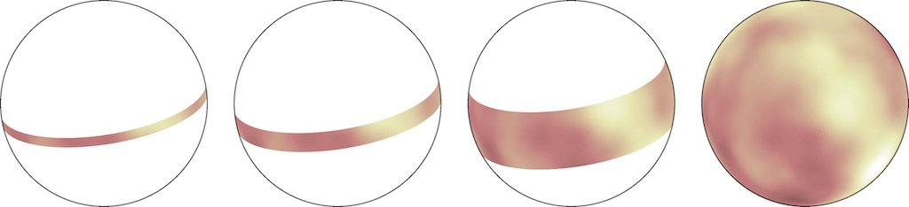
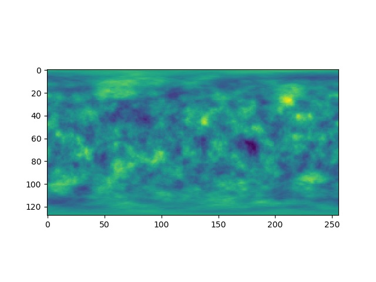
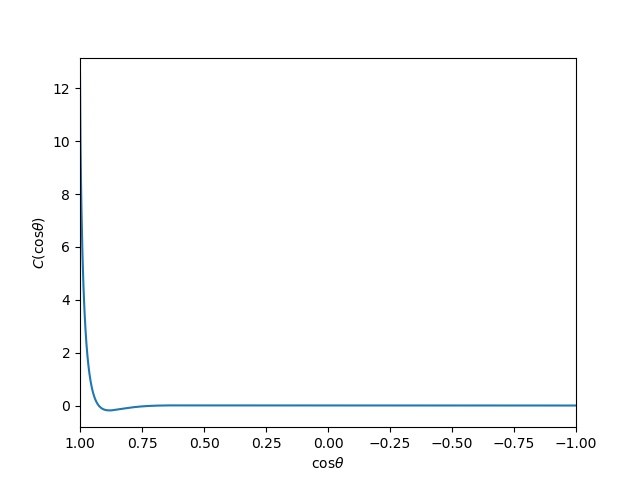

smerfs
======


### Stochastic Markov Evaluation of Random Fields on the Sphere

This code is based on the paper "Fast generation of isotropic Gaussian random fields on the sphere" by Peter Creasey and Annika Lang ([arxiv](https://arxiv.org/abs/1709.10314)).

Once you have downloaded Smerfs you will probably want to do the following:

## Install

Build the C-functions with

```bash
make
```

Run the tests, e.g. with

```bash
nosetests tests/
```
(use `-v` verbose or `-vs` for really verbose)

Add smerfs to your PYTHONPATH, perhaps in your .profile e.g.
```bash
PYTHONPATH="${PYTHONPATH}:${HOME}/codes/smerfs"
export PYTHONPATH
```

## Examples
These probably need at least python 2.7 and a (non-ancient) numpy and scipy. 

### Realise a spherical field with a given power spectrum
    
In a python environment try
    
```python
from smerfs import build_filter
import numpy as np
import matplotlib.pyplot as pl
nz = 128 # 128 points equally spaced in theta (z=cos(theta))
nphi = 256 # I usually use nphi=2*nz so regular pixels at equator
# GRF with C_lambda = 1/(1.0 + 10^-4 (lambda(lambda+1))^2)
coeffs = (1.0, 0.0, 1e-4) # this has length scale around l=10
sf = build_filter(nz=nz, nphi=nphi, coeffs=coeffs, dtype=np.float64) # Build the filter coefficients
# Make an example realisation
res = sf.create_realisation() # has shape (nz, nphi)
pl.imshow(res) # Plot
pl.show()
```

which should produce something like


### Plot the covariance function 

You can see the covariance as a function of angular separation with

```python
from smerfs.utils import analytic_cov
z = np.linspace(-1,1, 1000)
correl = analytic_cov(coeffs, z) # Contributions from Legendre polynomials
pl.plot(z, correl)
pl.xlabel(r'$\cos \theta$')
pl.ylabel(r'$C(\cos \theta)$')
pl.xlim(1,-1)
pl.show()
```

which should produce something like


All of these are equivalent to running

```
python examples/example1.py
```
